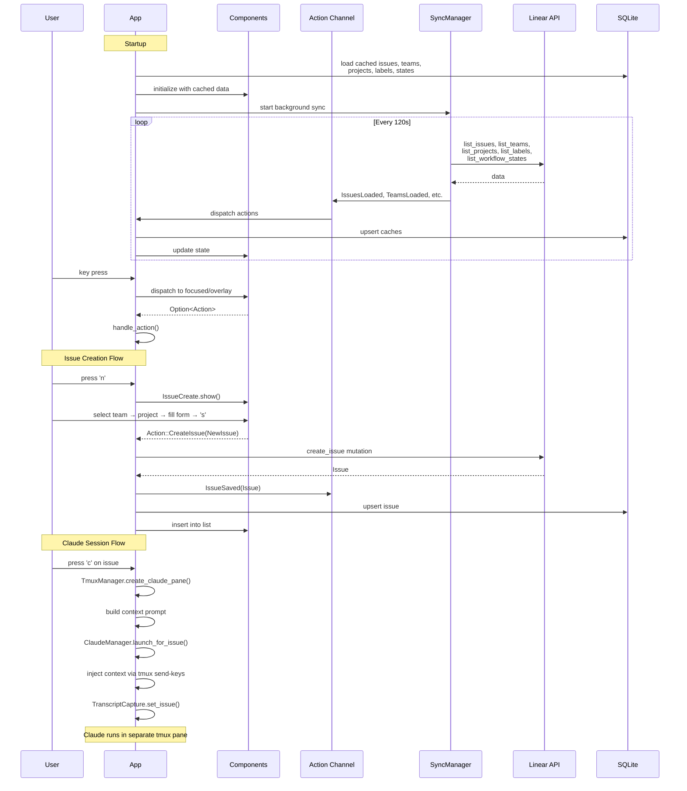
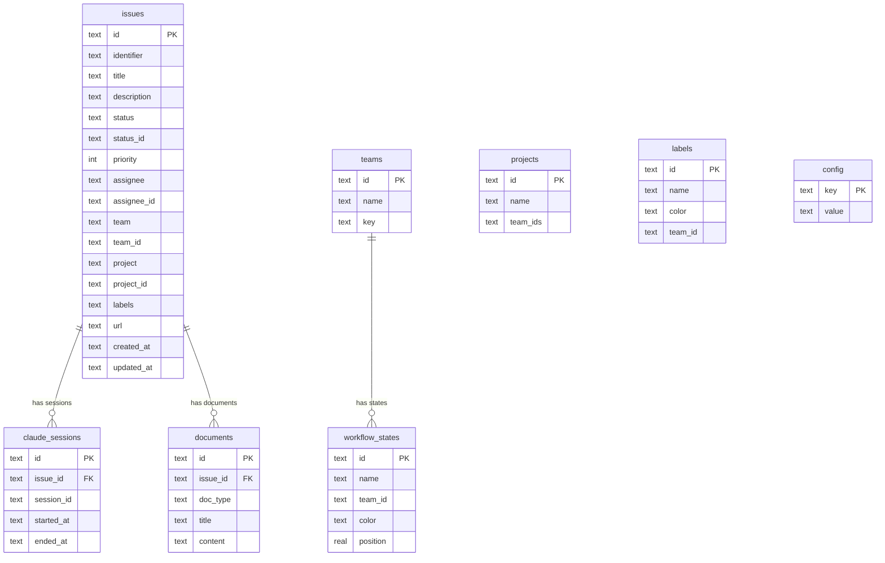

# ctxrecall

A terminal UI issue manager with Claude Code integration. Syncs with Linear, launches Claude sessions with rich issue context, captures transcripts, and summarizes them with pluggable LLM providers.

## Features

- **Linear sync** — background sync of issues, teams, projects, labels, and workflow states via GraphQL
- **Issue management** — browse, create, edit, filter by team/project/status, cycle statuses
- **Claude Code integration** — launch Claude sessions in a tmux pane with automatic context injection (issue details, past summaries, linked documents)
- **Transcript capture** — monitor Claude sessions and store raw transcripts
- **LLM summarization** — summarize transcripts with Claude API, OpenAI, or local Ollama
- **Full-text search** — FTS5-indexed search across issues, documents, and transcripts
- **Document viewer** — per-issue documents (PRDs, notes, plans, tasks)
- **Offline-first** — SQLite cache means the UI loads instantly and works without network

## Installation

```sh
cargo install --path .
```

## Quick Start

```sh
# Set your Linear API key (stored in local DB)
ctxrec --linear-api-key lin_api_...

# Run (auto-bootstraps a tmux session)
ctxrec

# Or skip tmux and run the TUI directly
ctxrec --no-tmux
```

## Configuration

All configuration is stored in a local SQLite database (`~/.local/share/ctxrecall/ctxrecall.db`).

### CLI Flags

| Flag | Description |
|------|-------------|
| `--linear-api-key KEY` | Set Linear API key (also reads `LINEAR_API_KEY` env) |
| `--set-project-dir "Name=/path"` | Map a Linear project to a local directory |
| `--set-team-dir "Name=/path"` | Map a Linear team to a local directory |
| `--set-llm-provider NAME` | Set LLM provider: `claude`, `openai`, or `ollama` |
| `--set-llm-api-key KEY` | Set LLM API key |
| `--set-llm-model MODEL` | Override default model |
| `--set-llm-ollama-url URL` | Set Ollama endpoint (default: `http://localhost:11434`) |
| `--no-tmux` | Skip tmux bootstrap |

### Project/Team Directory Mapping

When launching Claude for an issue, ctxrecall sets the working directory based on the issue's project or team:

```sh
ctxrec --set-project-dir "Backend=/home/user/repos/backend"
ctxrec --set-team-dir "Engineering=/home/user/repos/monorepo"
```

## Keyboard Shortcuts

### Issue List

| Key | Action |
|-----|--------|
| `j`/`k` | Move up/down |
| `Enter` | View issue detail |
| `n` | New issue |
| `e` | Edit issue |
| `s` | Cycle status |
| `f` | Filter by status |
| `t` | Filter by team |
| `p` | Filter by project |
| `c` | Launch Claude session |
| `T` | View transcripts |
| `d` | View documents |
| `r` | Refresh |
| `/` | Search |
| `h` | Help |
| `Ctrl-r` | Cycle pane size |
| `Ctrl-s` | Settings |
| `Ctrl-p` | Command palette |
| `q` | Quit |

### Detail Panel

| Key | Action |
|-----|--------|
| `j`/`k` | Scroll |
| `e` | Edit issue |
| `s` | Cycle status |
| `n` | New issue |
| `c` | Launch Claude |
| `Tab` | Switch focus |
| `Esc` | Back to list |

## Architecture

```mermaid
graph TB
    subgraph Terminal["Terminal Layer"]
        Crossterm["crossterm<br/>keyboard & resize events"]
        Ratatui["ratatui<br/>TUI rendering"]
    end

    subgraph Core["Core Event Loop"]
        EventHandler["EventHandler<br/>async event stream"]
        App["App<br/>state machine & dispatch"]
        ActionChannel["Action Channel<br/>mpsc::unbounded"]
    end

    subgraph Components["UI Components"]
        IssueList["IssueList"]
        IssueDetail["IssueDetail"]
        IssueCreate["IssueCreate"]
        IssueEdit["IssueEdit"]
        Dashboard["Dashboard"]
        Search["SearchOverlay"]
        CmdPalette["CommandPalette"]
        Settings["Settings"]
        FilterPicker["FilterPicker"]
        TranscriptViewer["TranscriptViewer"]
        DocViewer["DocumentViewer"]
        Help["HelpOverlay"]
        StatusBar["StatusBar"]
    end

    subgraph Data["Data Layer"]
        DB["SQLite<br/>rusqlite"]
        IssueRepo["issue_repo"]
        ConfigRepo["config_repo"]
        SearchRepo["search_repo<br/>FTS5"]
        SessionRepo["session_repo"]
        DocRepo["document_repo"]
    end

    subgraph Tracker["Linear Integration"]
        IssueTracker["IssueTracker trait"]
        LinearTracker["LinearTracker<br/>GraphQL client"]
        SyncManager["SyncManager<br/>background sync"]
    end

    subgraph Claude["Claude Integration"]
        ClaudeManager["ClaudeManager<br/>session lifecycle"]
        ContextBuilder["context.rs<br/>prompt builder"]
        TranscriptCapture["TranscriptCapture<br/>tmux monitor"]
    end

    subgraph LLM["LLM Summarization"]
        LlmProvider["LlmProvider trait"]
        ClaudeAPI["Claude API"]
        OpenAI["OpenAI"]
        Ollama["Ollama"]
        Summarizer["Summarizer<br/>periodic task"]
    end

    subgraph Tmux["Tmux Layer"]
        TmuxManager["TmuxManager<br/>pane control"]
    end

    Crossterm --> EventHandler
    EventHandler --> App
    App --> ActionChannel
    ActionChannel --> App
    App --> Ratatui

    App --> IssueList & IssueDetail & IssueCreate & IssueEdit
    App --> Dashboard & Search & CmdPalette & Settings
    App --> FilterPicker & TranscriptViewer & DocViewer
    App --> Help & StatusBar

    App --> DB
    DB --> IssueRepo & ConfigRepo & SearchRepo & SessionRepo & DocRepo

    SyncManager --> ActionChannel
    SyncManager --> IssueTracker
    IssueTracker --> LinearTracker

    App --> ClaudeManager
    ClaudeManager --> TmuxManager
    ClaudeManager --> ContextBuilder
    TranscriptCapture --> TmuxManager
    TranscriptCapture --> DB

    Summarizer --> LlmProvider
    LlmProvider --> ClaudeAPI & OpenAI & Ollama
    Summarizer --> ActionChannel
```







## Project Structure

```
src/
├── main.rs                # CLI parsing, startup, tmux bootstrap
├── app.rs                 # Main state machine & event loop
├── action.rs              # Action enum (all state mutations)
├── event.rs               # Terminal event handling
├── errors.rs              # AppError types
├── tui.rs                 # Terminal setup/teardown
├── logging.rs             # Tracing/log initialization
│
├── components/            # UI components (all impl Component trait)
│   ├── issue_list.rs      # Main issue browser with filtering
│   ├── issue_detail.rs    # Issue detail view
│   ├── issue_create.rs    # Multi-step issue creation form
│   ├── issue_edit.rs      # Issue edit form
│   ├── dashboard.rs       # Stats panel
│   ├── search.rs          # Full-text search overlay
│   ├── command_palette.rs # Quick action launcher
│   ├── settings.rs        # Configuration panel
│   ├── filter_picker.rs   # Team/project filter modal
│   ├── transcript_viewer.rs
│   ├── document_viewer.rs
│   ├── help_overlay.rs    # Keyboard shortcut reference
│   └── status_bar.rs
│
├── widgets/               # Reusable UI primitives
│   ├── modal.rs           # Modal dialog frame
│   ├── editable_field.rs  # Text input with cursor
│   ├── fuzzy_list.rs      # Fuzzy-filterable list
│   └── dropdown.rs        # Dropdown selector
│
├── tracker/               # Issue tracker abstraction
│   ├── mod.rs             # IssueTracker trait
│   ├── types.rs           # Issue, Team, Project, Label, etc.
│   ├── linear.rs          # Linear GraphQL client
│   └── sync.rs            # Background sync manager
│
├── db/                    # SQLite data layer
│   ├── mod.rs             # Init + migration runner
│   ├── issue_repo.rs      # Issue/team/project/label CRUD
│   ├── config_repo.rs     # Key-value config store
│   ├── search_repo.rs     # FTS5 search
│   ├── session_repo.rs    # Claude session tracking
│   └── document_repo.rs   # Per-issue documents
│
├── claude/                # Claude Code integration
│   ├── session.rs         # Session lifecycle manager
│   ├── context.rs         # Context prompt builder
│   └── transcript.rs      # Transcript capture from tmux
│
├── llm/                   # LLM summarization providers
│   ├── mod.rs             # LlmProvider trait + factory
│   ├── claude_api.rs      # Anthropic Claude
│   ├── openai.rs          # OpenAI
│   ├── ollama.rs          # Local Ollama
│   └── summarizer.rs      # Periodic summarization task
│
├── tmux/                  # Tmux integration
│   ├── mod.rs             # Pane management & bootstrap
│   └── layout.rs          # Layout helpers
│
└── config/                # Configuration
    ├── hotkeys.rs         # Keyboard bindings
    ├── theme.rs           # UI theme
    └── toml_io.rs         # TOML file I/O

migrations/                # SQLite schema (embedded at compile time)
├── 001_initial.sql        # Config, accounts, hotkeys, themes
├── 002_issues.sql         # Issues, teams, projects tables
├── 003_transcripts.sql    # Claude sessions & transcripts
├── 004_fts.sql            # Full-text search index
├── 005_issue_status_id.sql
├── 006_workflow_states.sql
├── 007_issue_team_id.sql
├── 008_issue_project_id.sql
├── 009_labels.sql
├── 010_issue_assignee_id.sql
└── 011_label_team_id.sql
```

## License

MIT
