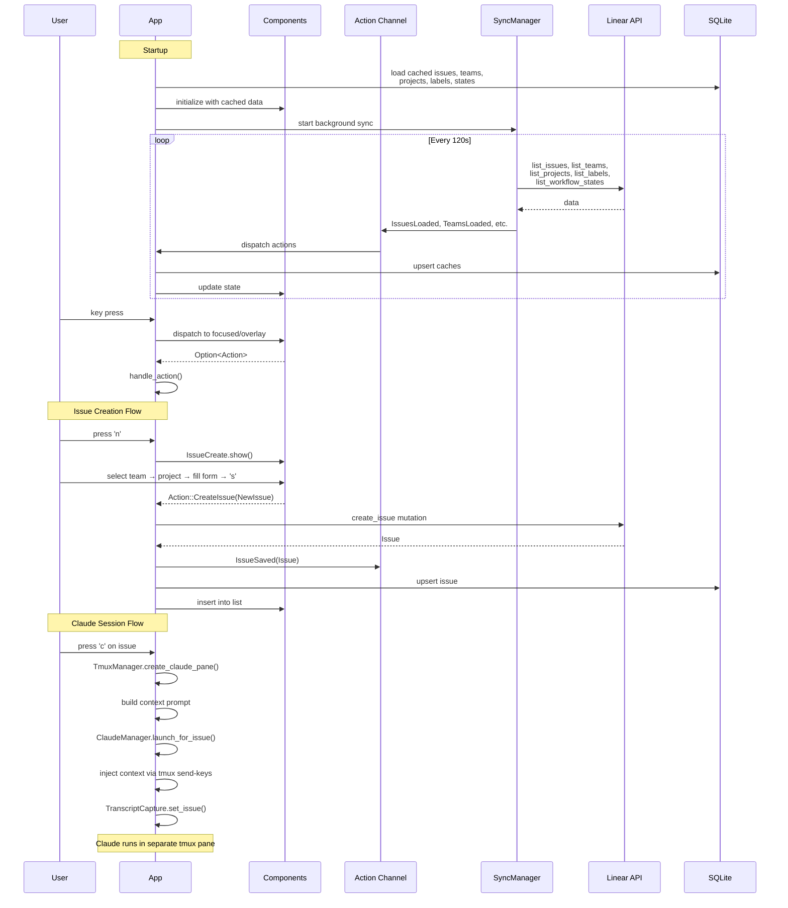
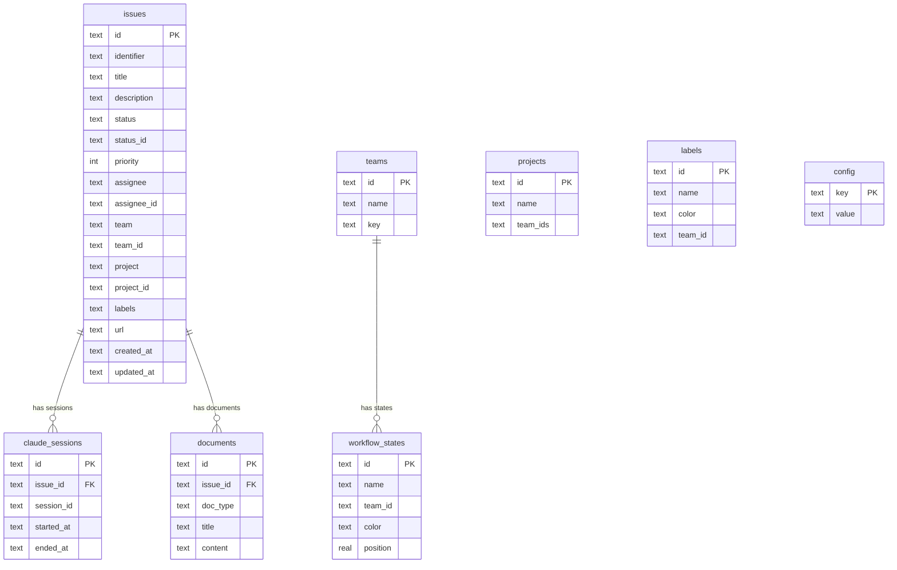

# Architecture

## System Overview

```mermaid
graph TB
    subgraph Terminal["Terminal Layer"]
        Crossterm["crossterm<br/>keyboard & resize events"]
        Ratatui["ratatui<br/>TUI rendering"]
    end

    subgraph Core["Core Event Loop"]
        EventHandler["EventHandler<br/>async event stream"]
        App["App<br/>state machine & dispatch"]
        ActionChannel["Action Channel<br/>mpsc::unbounded"]
    end

    subgraph Components["UI Components"]
        IssueList["IssueList"]
        IssueDetail["IssueDetail"]
        IssueCreate["IssueCreate"]
        IssueEdit["IssueEdit"]
        Dashboard["Dashboard"]
        Search["SearchOverlay"]
        CmdPalette["CommandPalette"]
        Settings["Settings"]
        FilterPicker["FilterPicker"]
        TranscriptViewer["TranscriptViewer"]
        DocViewer["DocumentViewer"]
        Help["HelpOverlay"]
        StatusBar["StatusBar"]
    end

    subgraph Data["Data Layer"]
        DB["SQLite<br/>rusqlite"]
        IssueRepo["issue_repo"]
        ConfigRepo["config_repo"]
        SearchRepo["search_repo<br/>FTS5"]
        SessionRepo["session_repo"]
        DocRepo["document_repo"]
    end

    subgraph Tracker["Linear Integration"]
        IssueTracker["IssueTracker trait"]
        LinearTracker["LinearTracker<br/>GraphQL client"]
        SyncManager["SyncManager<br/>background sync"]
    end

    subgraph Claude["Claude Integration"]
        ClaudeManager["ClaudeManager<br/>session lifecycle"]
        ContextBuilder["context.rs<br/>prompt builder"]
        TranscriptCapture["TranscriptCapture<br/>tmux monitor"]
    end

    subgraph LLM["LLM Summarization"]
        LlmProvider["LlmProvider trait"]
        ClaudeAPI["Claude API"]
        OpenAI["OpenAI"]
        Ollama["Ollama"]
        Summarizer["Summarizer<br/>periodic task"]
    end

    subgraph Tmux["Tmux Layer"]
        TmuxManager["TmuxManager<br/>pane control"]
    end

    Crossterm --> EventHandler
    EventHandler --> App
    App --> ActionChannel
    ActionChannel --> App
    App --> Ratatui

    App --> IssueList & IssueDetail & IssueCreate & IssueEdit
    App --> Dashboard & Search & CmdPalette & Settings
    App --> FilterPicker & TranscriptViewer & DocViewer
    App --> Help & StatusBar

    App --> DB
    DB --> IssueRepo & ConfigRepo & SearchRepo & SessionRepo & DocRepo

    SyncManager --> ActionChannel
    SyncManager --> IssueTracker
    IssueTracker --> LinearTracker

    App --> ClaudeManager
    ClaudeManager --> TmuxManager
    ClaudeManager --> ContextBuilder
    TranscriptCapture --> TmuxManager
    TranscriptCapture --> DB

    Summarizer --> LlmProvider
    LlmProvider --> ClaudeAPI & OpenAI & Ollama
    Summarizer --> ActionChannel
```

## Event Flow

```mermaid
sequenceDiagram
    participant User
    participant App
    participant Components
    participant ActionCh as Action Channel
    participant Sync as SyncManager
    participant Linear as Linear API
    participant DB as SQLite

    Note over App: Startup
    App->>DB: load cached issues, teams,<br/>projects, labels, states
    App->>Components: initialize with cached data
    App->>Sync: start background sync

    loop Every 120s
        Sync->>Linear: list_issues, list_teams,<br/>list_projects, list_labels,<br/>list_workflow_states
        Linear-->>Sync: data
        Sync->>ActionCh: IssuesLoaded, TeamsLoaded, etc.
        ActionCh->>App: dispatch actions
        App->>DB: upsert caches
        App->>Components: update state
    end

    User->>App: key press
    App->>Components: dispatch to focused/overlay
    Components-->>App: Option<Action>
    App->>App: handle_action()

    Note over User,App: Issue Creation Flow
    User->>App: press 'n'
    App->>Components: IssueCreate.show()
    User->>Components: select team → project → fill form → 's'
    Components-->>App: Action::CreateIssue(NewIssue)
    App->>Linear: create_issue mutation
    Linear-->>App: Issue
    App->>ActionCh: IssueSaved(Issue)
    App->>DB: upsert issue
    App->>Components: insert into list

    Note over User,App: Claude Session Flow
    User->>App: press 'c' on issue
    App->>App: TmuxManager.create_claude_pane()
    App->>App: build context prompt
    App->>App: ClaudeManager.launch_for_issue()
    App->>App: inject context via tmux send-keys
    App->>App: TranscriptCapture.set_issue()
    Note over App: Claude runs in separate tmux pane
```

## Database Schema

```mermaid
erDiagram
    issues {
        text id PK
        text identifier
        text title
        text description
        text status
        text status_id
        int priority
        text assignee
        text assignee_id
        text team
        text team_id
        text project
        text project_id
        text labels
        text url
        text created_at
        text updated_at
    }

    teams {
        text id PK
        text name
        text key
    }

    projects {
        text id PK
        text name
        text team_ids
    }

    labels {
        text id PK
        text name
        text color
        text team_id
    }

    workflow_states {
        text id PK
        text name
        text team_id
        text color
        real position
    }

    claude_sessions {
        text id PK
        text issue_id FK
        text session_id
        text started_at
        text ended_at
    }

    documents {
        text id PK
        text issue_id FK
        text doc_type
        text title
        text content
    }

    config {
        text key PK
        text value
    }

    issues ||--o{ claude_sessions : "has sessions"
    issues ||--o{ documents : "has documents"
    teams ||--o{ workflow_states : "has states"
```
